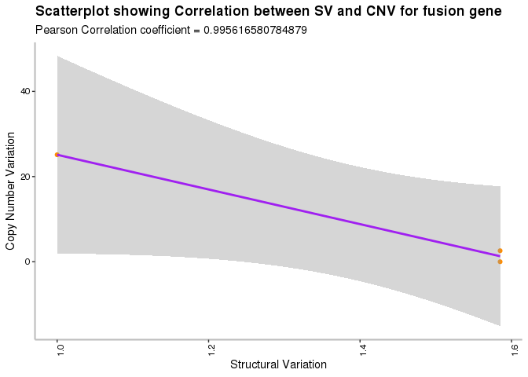
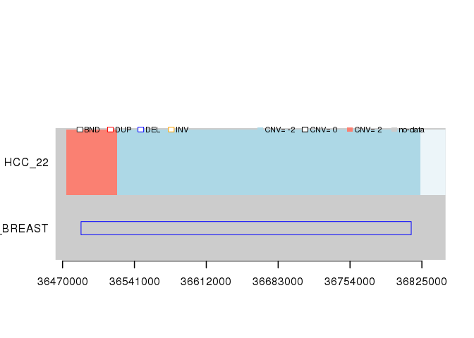
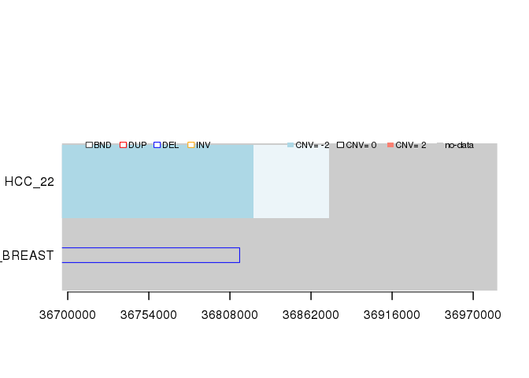
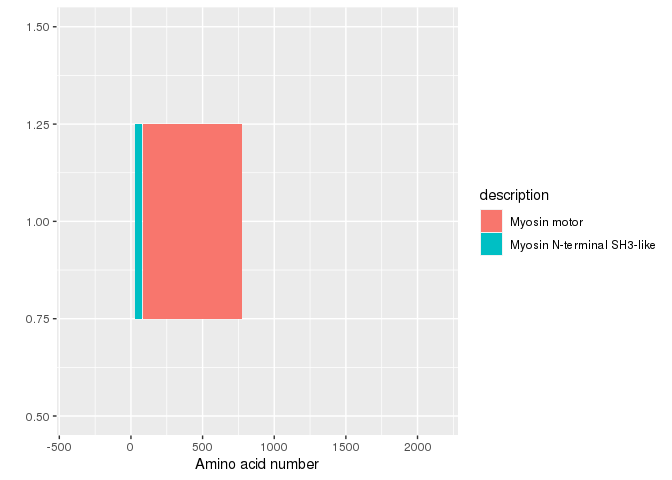
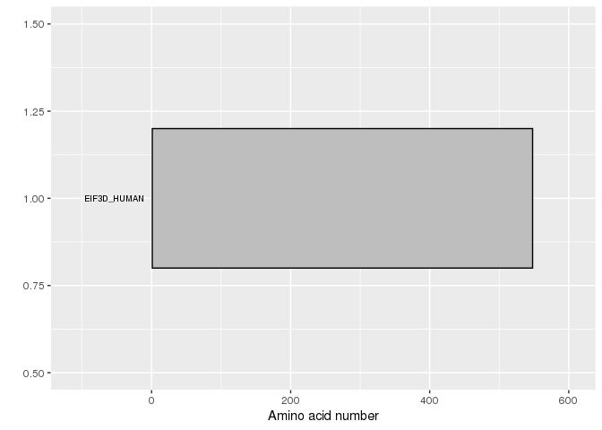

<!-- README.md is generated from README.Rmd. Please edit that file -->

# DriverFuse

<!-- badges: start -->

<!-- badges: end -->

The goal of DriverFuse is to become instrumental in the study of Driver
fusion genes in cancer genomics, enabling the identification of
recurrent complex rearrangements that may pinpoint disease driver
events. Here,we implement the methodological framework into an R package
incorporating multiple functionalities to integrate orthogonal data
types such as SV and CNV and characterize fusion gene in breast cancer
datasets.

input\_svc creates input structural varaint file for a user sample data
that is used for mapping fusion gene to find out whether it is “Driver”
or “Passenger” fusion gene.

input\_cnv creates input copy number variation file for a user sample
data that is used for mapping fusion gene to find out out whether it is
“Driver” or “Passenger” fusion gene.

input creates localization of breakpoints with respect to known genes.
The annotation identifies small segmental variants overlapping with
genes.

Driver\_result classifies input fusion gene into “Driver” or “Passenger”
fusion gene based on mapping coordinates in structural variant and copy
number variation.

Driver\_object creates object of input fusion gene based on their
mapping structural variant and copy number variation.

Driver\_correlation\_coefficient plots the correlation coefficient
between mapping structural variant and copy number variation profile for
a given input fusion gene.

Driver\_plot plots mapping structural variants and CNV profile for input
fusion transcripts. It plots the CNV profile and structural variants
that are mapping to genomic coordinates of input fusion genes.

Driver\_domain provides genomic feature annotation tools for driver
fusion gene. Exploring domain level landscape of fusion gene is
important to identify gene role in cancer progresssion.

## Installation

You can install the released version of DriverFuse from
[CRAN](https://CRAN.R-project.org) with:

``` r
install.packages("DriverFuse")
```

## Example

This is a basic example which shows you how to solve a common problem:

``` r
library(DriverFuse)
## basic example code
```

What is special about using `README.Rmd` instead of just `README.md`?
You can include R chunks like so:

``` r
summary(mtcars)
#>       mpg             cyl             disp             hp       
#>  Min.   :10.40   Min.   :4.000   Min.   : 71.1   Min.   : 52.0  
#>  1st Qu.:15.43   1st Qu.:4.000   1st Qu.:120.8   1st Qu.: 96.5  
#>  Median :19.20   Median :6.000   Median :196.3   Median :123.0  
#>  Mean   :20.09   Mean   :6.188   Mean   :230.7   Mean   :146.7  
#>  3rd Qu.:22.80   3rd Qu.:8.000   3rd Qu.:326.0   3rd Qu.:180.0  
#>  Max.   :33.90   Max.   :8.000   Max.   :472.0   Max.   :335.0  
#>       drat             wt             qsec             vs        
#>  Min.   :2.760   Min.   :1.513   Min.   :14.50   Min.   :0.0000  
#>  1st Qu.:3.080   1st Qu.:2.581   1st Qu.:16.89   1st Qu.:0.0000  
#>  Median :3.695   Median :3.325   Median :17.71   Median :0.0000  
#>  Mean   :3.597   Mean   :3.217   Mean   :17.85   Mean   :0.4375  
#>  3rd Qu.:3.920   3rd Qu.:3.610   3rd Qu.:18.90   3rd Qu.:1.0000  
#>  Max.   :4.930   Max.   :5.424   Max.   :22.90   Max.   :1.0000  
#>        am              gear            carb      
#>  Min.   :0.0000   Min.   :3.000   Min.   :1.000  
#>  1st Qu.:0.0000   1st Qu.:3.000   1st Qu.:2.000  
#>  Median :0.0000   Median :4.000   Median :2.000  
#>  Mean   :0.4062   Mean   :3.688   Mean   :2.812  
#>  3rd Qu.:1.0000   3rd Qu.:4.000   3rd Qu.:4.000  
#>  Max.   :1.0000   Max.   :5.000   Max.   :8.000
library(svpluscnv)
#> 
#> Warning in fun(libname, pkgname): couldn't connect to display ":0"
#> 
#> Attaching package: 'svpluscnv'
#> The following object is masked from 'package:DriverFuse':
#> 
#>     sv.model.view
library(GenomicRanges)
#> Loading required package: stats4
#> Loading required package: BiocGenerics
#> Loading required package: parallel
#> 
#> Attaching package: 'BiocGenerics'
#> The following objects are masked from 'package:parallel':
#> 
#>     clusterApply, clusterApplyLB, clusterCall, clusterEvalQ,
#>     clusterExport, clusterMap, parApply, parCapply, parLapply,
#>     parLapplyLB, parRapply, parSapply, parSapplyLB
#> The following objects are masked from 'package:stats':
#> 
#>     IQR, mad, sd, var, xtabs
#> The following objects are masked from 'package:base':
#> 
#>     anyDuplicated, append, as.data.frame, basename, cbind, colnames,
#>     dirname, do.call, duplicated, eval, evalq, Filter, Find, get, grep,
#>     grepl, intersect, is.unsorted, lapply, Map, mapply, match, mget,
#>     order, paste, pmax, pmax.int, pmin, pmin.int, Position, rank,
#>     rbind, Reduce, rownames, sapply, setdiff, sort, table, tapply,
#>     union, unique, unsplit, which, which.max, which.min
#> Loading required package: S4Vectors
#> 
#> Attaching package: 'S4Vectors'
#> The following object is masked from 'package:base':
#> 
#>     expand.grid
#> Loading required package: IRanges
#> Loading required package: GenomeInfoDb
cnv <- validate.cnv(nbl_segdat)
svc <- validate.svc(nbl_svdat)
results_svc <- svc.break.annot(svc, svc.seg.size = 200000, genome.v="hg19",upstr = 100000, verbose=FALSE)
#> 'select()' returned 1:1 mapping between keys and columns
Driver_result_list = function(x){
  for (i in 1:length(x)){
    y = strsplit(x[i], "-")
    m = as.character(unlist(y))
    library(org.Hs.eg.db)
    library(drawProteins)
    gene <- m[1]
    gene.dt <- gene.track.view(symbol = gene, plot=FALSE)
    start <- min(gene.dt@data$txStart) - 200000
    stop <- max(gene.dt@data$txEnd) + 50000
    chr <- gene.dt@data$chrom[1]
    sampleids <- sort(results_svc@disruptSamples[[gene]])
    gene1 <- m[2]
    gene.dt1 <- gene.track.view(symbol = gene1, plot=FALSE)
    start1 <- min(gene.dt1@data$txStart) - 200000
    stop1 <- max(gene.dt1@data$txEnd) + 50000
    chr1 <- gene.dt1@data$chrom[1]
    sampleids1 <- sort(results_svc@disruptSamples[[gene1]])
    svcdat <- svc@data
    cnvdat <- cnv@data
    genegr <- with(data.frame(chr,start,stop), GRanges(chr, IRanges(start=start, end=stop))) 
    sv1gr = with(svcdat, GRanges(chrom1, IRanges(start=pos1, end=pos1))) 
    sv2gr = with(svcdat, GRanges(chrom2, IRanges(start=pos2, end=pos2))) 
    sv_hits1 = GenomicAlignments::findOverlaps(sv1gr,genegr)
    sv_hits2 = GenomicAlignments::findOverlaps(sv2gr,genegr)
    svtab1 <- svcdat[sort(unique(c(queryHits(sv_hits1),queryHits(sv_hits2)))),]
    genegr1 <- with(data.frame(chr1,start1,stop1), GRanges(chr1, IRanges(start=start, end=stop))) 
    sv1gr = with(svcdat, GRanges(chrom1, IRanges(start=pos1, end=pos1))) 
    sv2gr = with(svcdat, GRanges(chrom2, IRanges(start=pos2, end=pos2))) 
    sv_hits1 = GenomicAlignments::findOverlaps(sv1gr,genegr1)
    sv_hits2 = GenomicAlignments::findOverlaps(sv2gr,genegr1)
    svtab2 <- svcdat[sort(unique(c(queryHits(sv_hits1),queryHits(sv_hits2)))),]
    seg1br  = with(cnvdat, GRanges(chrom, IRanges(start=start, end=start))) 
    seg2br  = with(cnvdat, GRanges(chrom, IRanges(start=end, end=end))) 
    seg_hits1 = GenomicAlignments::findOverlaps(seg1br,genegr)
    seg_hits2 = GenomicAlignments::findOverlaps(seg2br,genegr)
    segbrk1 <- cnvdat[sort(unique(c(queryHits(seg_hits1),queryHits(seg_hits2))))]
    seg1br  = with(cnvdat, GRanges(chrom, IRanges(start=start, end=start))) 
    seg2br  = with(cnvdat, GRanges(chrom, IRanges(start=end, end=end))) 
    seg_hits1 = GenomicAlignments::findOverlaps(seg1br,genegr1)
    seg_hits2 = GenomicAlignments::findOverlaps(seg2br,genegr1)
    segbrk2 <- cnvdat[sort(unique(c(queryHits(seg_hits1),queryHits(seg_hits2))))]
    if (nrow(svtab1) > 0 & nrow(svtab2) > 0){
      print("Driver")
    } else {
      print("Passenger")
    }
  }
}
df <- c("TRIM24-BRAF", "CUX1-RET", "CCDC6-ROS1", "CLTC-ROS1", "ALK-HMBOX1")
Driver_result_list(df)
#> Loading required package: AnnotationDbi
#> Loading required package: Biobase
#> Welcome to Bioconductor
#> 
#>     Vignettes contain introductory material; view with
#>     'browseVignettes()'. To cite Bioconductor, see
#>     'citation("Biobase")', and for packages 'citation("pkgname")'.
#> [1] "Driver"
#> [1] "Driver"
#> [1] "Passenger"
#> [1] "Passenger"
#> [1] "Driver"

Driver_result = function(x){
    y = strsplit(x, "-")
    m = as.character(unlist(y))
    library(org.Hs.eg.db)
    library(drawProteins)
    gene <- m[1]
    gene.dt <- gene.track.view(symbol = gene, plot=FALSE, genome.v = "hg19")
    start <- min(gene.dt@data$txStart) - 200000
    stop <- max(gene.dt@data$txEnd) + 50000
    chr <- gene.dt@data$chrom[1]
    sampleids <- sort(results_svc@disruptSamples[[gene]])
    gene1 <- m[2]
    gene.dt1 <- gene.track.view(symbol = gene1, plot=FALSE, genome.v = "hg19")
    start1 <- min(gene.dt1@data$txStart) - 200000
    stop1 <- max(gene.dt1@data$txEnd) + 50000
    chr1 <- gene.dt1@data$chrom[1]
    sampleids1 <- sort(results_svc@disruptSamples[[gene1]])
    svcdat <- svc@data
    cnvdat <- cnv@data
    genegr <- with(data.frame(chr,start,stop), GRanges(chr, IRanges(start=start, end=stop))) 
    sv1gr = with(svcdat, GRanges(chrom1, IRanges(start=pos1, end=pos1))) 
    sv2gr = with(svcdat, GRanges(chrom2, IRanges(start=pos2, end=pos2))) 
    sv_hits1 = GenomicAlignments::findOverlaps(sv1gr,genegr)
    sv_hits2 = GenomicAlignments::findOverlaps(sv2gr,genegr)
    svtab1 <- svcdat[sort(unique(c(queryHits(sv_hits1),queryHits(sv_hits2)))),]
    genegr1 <- with(data.frame(chr1,start1,stop1), GRanges(chr1, IRanges(start=start, end=stop))) 
    sv1gr = with(svcdat, GRanges(chrom1, IRanges(start=pos1, end=pos1))) 
    sv2gr = with(svcdat, GRanges(chrom2, IRanges(start=pos2, end=pos2))) 
    sv_hits1 = GenomicAlignments::findOverlaps(sv1gr,genegr1)
    sv_hits2 = GenomicAlignments::findOverlaps(sv2gr,genegr1)
    svtab2 <- svcdat[sort(unique(c(queryHits(sv_hits1),queryHits(sv_hits2)))),]
    seg1br  = with(cnvdat, GRanges(chrom, IRanges(start=start, end=start))) 
    seg2br  = with(cnvdat, GRanges(chrom, IRanges(start=end, end=end))) 
    seg_hits1 = GenomicAlignments::findOverlaps(seg1br,genegr)
    seg_hits2 = GenomicAlignments::findOverlaps(seg2br,genegr)
    segbrk1 <- cnvdat[sort(unique(c(queryHits(seg_hits1),queryHits(seg_hits2))))]
    seg1br  = with(cnvdat, GRanges(chrom, IRanges(start=start, end=start))) 
    seg2br  = with(cnvdat, GRanges(chrom, IRanges(start=end, end=end))) 
    seg_hits1 = GenomicAlignments::findOverlaps(seg1br,genegr1)
    seg_hits2 = GenomicAlignments::findOverlaps(seg2br,genegr1)
    segbrk2 <- cnvdat[sort(unique(c(queryHits(seg_hits1),queryHits(seg_hits2))))]
    if (nrow(svtab1) > 0 & nrow(svtab2) > 0) {
        print("Driver fusion gene")
    } else {
        print("Passenger fusion gene")
    }
}
Driver_result("CUX1-RET")
#> [1] "Driver fusion gene"

Driver_obj = function(x){
  y = strsplit(x, "-")
  m = as.character(unlist(y))
  library(org.Hs.eg.db)
  library(drawProteins)
  gene <- m[1]
  gene.dt <- gene.track.view(symbol = gene, plot=FALSE, genome.v = "hg19")
  start <- min(gene.dt@data$txStart) - 200000
  stop <- max(gene.dt@data$txEnd) + 50000
  chr <- gene.dt@data$chrom[1]
  sampleids <- sort(results_svc@disruptSamples[[gene]])
  gene1 <- m[2]
  gene.dt1 <- gene.track.view(symbol = gene1, plot=FALSE, genome.v = "hg19")
  start1 <- min(gene.dt1@data$txStart) - 200000
  stop1 <- max(gene.dt1@data$txEnd) + 50000
  chr1 <- gene.dt1@data$chrom[1]
  svcdat = svc@data
  cnvdat = cnv@data
  data2 = svcdat
  genegr <- with(data.frame(chr,start,stop), GRanges(chr, IRanges(start=start, end=stop))) 
  sv1gr = with(data2, GRanges(chrom1, IRanges(start=pos1, end=pos1))) 
  sv2gr = with(data2 , GRanges(chrom2, IRanges(start=pos2, end=pos2))) 
  sv_hits1 = GenomicAlignments::findOverlaps(sv1gr,genegr)
  sv_hits2 = GenomicAlignments::findOverlaps(sv2gr,genegr)
  svtab1 <- data2[sort(unique(c(queryHits(sv_hits1),queryHits(sv_hits2)))),]
  genegr <- with(data.frame(chr1,start1,stop1), GRanges(chr, IRanges(start=start1, end=stop1)))
  sv1gr = with(data2, GRanges(chrom1, IRanges(start=pos1, end=pos1))) 
  sv2gr = with(data2 , GRanges(chrom2, IRanges(start=pos2, end=pos2))) 
  sv_hits1 = GenomicAlignments::findOverlaps(sv1gr,genegr)
  sv_hits2 = GenomicAlignments::findOverlaps(sv2gr,genegr)
  svtab2 <- data2[sort(unique(c(queryHits(sv_hits1),queryHits(sv_hits2)))),]
  cnvdat = cnv@data
  genegr <- with(data.frame(chr,start,stop), GRanges(chr, IRanges(start=start, end=stop))) 
  seg1br  = with(cnvdat, GRanges(chrom, IRanges(start=start, end=start))) 
  seg2br  = with(cnvdat, GRanges(chrom, IRanges(start=end, end=end))) 
  seg_hits1 = GenomicAlignments::findOverlaps(seg1br,genegr)
  seg_hits2 = GenomicAlignments::findOverlaps(seg2br,genegr)
  segbrk_first <- cnvdat[sort(unique(c(queryHits(seg_hits1),queryHits(seg_hits2))))]
  genegr <- with(data.frame(chr1,start1,stop1), GRanges(chr, IRanges(start=start1, end=stop1)))
  seg1br  = with(cnvdat, GRanges(chrom, IRanges(start=start, end=start))) 
  seg2br  = with(cnvdat, GRanges(chrom, IRanges(start=end, end=end))) 
  seg_hits1 = GenomicAlignments::findOverlaps(seg1br,genegr)
  seg_hits2 = GenomicAlignments::findOverlaps(seg2br,genegr)
  segbrk_second <- cnvdat[sort(unique(c(queryHits(seg_hits1),queryHits(seg_hits2))))]
  Driver_res1 = list(svtab1,segbrk_first,svtab2,segbrk_second)
  head(Driver_res1)
}
Driver_obj("CUX1-RET")
#> [[1]]
#>    sample chrom1     pos1 strand1 chrom2      pos2 strand2 svclass
#> 1: PAPKXS   chr7 56992294       -   chr7 101688968       -     DUP
#>               uid
#> 1: svc_qetkSSAsXh
#> 
#> [[2]]
#>    sample chrom     start       end probes segmean            uid
#> 1: PASTKC  chr7  97617000 101911000   2123  0.5294 cnv_PuquWPlqLe
#> 2: PASTKC  chr7 101913000 112807000   5448  0.4471 cnv_HIPcmZmPel
#> 
#> [[3]]
#> Empty data.table (0 rows and 9 cols): sample,chrom1,pos1,strand1,chrom2,pos2...
#> 
#> [[4]]
#>    sample chrom    start      end probes segmean            uid
#> 1: PAISNS  chr7 40411000 43579000   1585  0.5420 cnv_UJcwMdByaf
#> 2: PAISNS  chr7 43581000 45437000    929  0.3382 cnv_YVclGQsapj
#> 3: PAIVZR  chr7 40327000 43515000   1595  0.0567 cnv_xFsiDXkUTE
#> 4: PAIVZR  chr7 43517000 45411000    948 -0.1288 cnv_vJfIfNKZje
#> 5: PASXHE  chr7 20725000 43517000  11397  0.5549 cnv_pvCUJvVrqE
#> 6: PASXHE  chr7 43519000 52863000   4653 -0.0355 cnv_eDmmJpsAog

Driver_correlation_coefficient = function(x){
  y = strsplit(x, "-")
  m = as.character(unlist(y))
  library(org.Hs.eg.db)
  library(drawProteins)
  gene <- m[1]
  gene.dt <- gene.track.view(symbol = gene, plot=FALSE, genome.v = "hg19")
  start <- min(gene.dt@data$txStart) - 200000
  stop <- max(gene.dt@data$txEnd) + 50000
  chr <- gene.dt@data$chrom[1]
  sampleids <- sort(results_svc@disruptSamples[[gene]])
  gene1 <- m[2]
  gene.dt1 <- gene.track.view(symbol = gene1, plot=FALSE, genome.v = "hg19")
  start1 <- min(gene.dt1@data$txStart) - 200000
  stop1 <- max(gene.dt1@data$txEnd) + 50000
  chr1 <- gene.dt1@data$chrom[1]
  svcdat = svc@data
  data2 = svcdat
  cnvdat = cnv@data
  genegr <- with(data.frame(chr,start,stop), GRanges(chr, IRanges(start=start, end=stop))) 
  sv1gr = with(data2, GRanges(chrom1, IRanges(start=pos1, end=pos1))) 
  sv2gr = with(data2 , GRanges(chrom2, IRanges(start=pos2, end=pos2))) 
  sv_hits1 = GenomicAlignments::findOverlaps(sv1gr,genegr)
  sv_hits2 = GenomicAlignments::findOverlaps(sv2gr,genegr)
  svtab1 <- data2[sort(unique(c(queryHits(sv_hits1),queryHits(sv_hits2)))),]
  genegr <- with(data.frame(chr1,start1,stop1), GRanges(chr, IRanges(start=start1, end=stop1)))
  sv1gr = with(data2, GRanges(chrom1, IRanges(start=pos1, end=pos1))) 
  sv2gr = with(data2 , GRanges(chrom2, IRanges(start=pos2, end=pos2))) 
  sv_hits1 = GenomicAlignments::findOverlaps(sv1gr,genegr)
  sv_hits2 = GenomicAlignments::findOverlaps(sv2gr,genegr)
  svtab2 <- data2[sort(unique(c(queryHits(sv_hits1),queryHits(sv_hits2)))),]
  cnvdat = cnv@data
  genegr <- with(data.frame(chr,start,stop), GRanges(chr, IRanges(start=start, end=stop))) 
  seg1br  = with(cnvdat, GRanges(chrom, IRanges(start=start, end=start))) 
  seg2br  = with(cnvdat, GRanges(chrom, IRanges(start=end, end=end))) 
  seg_hits1 = GenomicAlignments::findOverlaps(seg1br,genegr)
  seg_hits2 = GenomicAlignments::findOverlaps(seg2br,genegr)
  segbrk_first <- cnvdat[sort(unique(c(queryHits(seg_hits1),queryHits(seg_hits2))))]
  genegr <- with(data.frame(chr1,start1,stop1), GRanges(chr, IRanges(start=start1, end=stop1)))
  seg1br  = with(cnvdat, GRanges(chrom, IRanges(start=start, end=start))) 
  seg2br  = with(cnvdat, GRanges(chrom, IRanges(start=end, end=end))) 
  seg_hits1 = GenomicAlignments::findOverlaps(seg1br,genegr)
  seg_hits2 = GenomicAlignments::findOverlaps(seg2br,genegr)
  segbrk_second <- cnvdat[sort(unique(c(queryHits(seg_hits1),queryHits(seg_hits2))))]
  cv1 <- validate.cnv(segbrk_first)
  cv2 <- validate.cnv(segbrk_second)
  sv1 <- validate.svc(svtab1)
  sv2 <- validate.svc(svtab2)
  svc_breaks  <- svc.breaks(sv1)  
  cnv_breaks  <- cnv.breaks(cv1,verbose=FALSE)
  if (nrow(segbrk_first) > 0 ) {
    cnv_breaks  <- cnv.breaks(cv1,verbose=FALSE)
  } else {
    cnv_breaks <- 0
  }
  dat1 <- as.data.frame(log2(1+cbind(svc_breaks@burden,cnv_breaks@burden))) 
  svc_breaks <- svc.breaks(sv2)
  if (nrow(segbrk_second) > 0 ) {
  cnv_breaks  <- cnv.breaks(cv1,verbose=FALSE)
  } else {
    cnv_breaks@burden <- 0
  }
  dat2 <- as.data.frame(log2(1+cbind(svc_breaks@burden,0)))
  z = nrow(cnv@data)/nrow(data2)
  dat3 = as.data.frame(c("1",z))
  dat3 = as.data.frame(t(dat3))
  corr_coff = rbind(dat1,dat2,dat3)
  head(corr_coff)
  before_correction<- c(as.numeric(corr_coff$V1))
  after_correction<- c(as.numeric(corr_coff$V2))

#calculating correlation
  corr_coef <- abs(cor(before_correction, after_correction))


  plot1 <- ggplot2::ggplot(corr_coff, ggplot2::aes(x=before_correction, y=after_correction))+
      ggplot2::geom_point(color = "darkorange") + ggplot2::geom_smooth(method = "lm", colour = "purple") +
      ggplot2::labs(x = "Structural Variation",
                    y = "Copy Number Variation",
                    title = "Scatterplot showing Correlation between SV and CNV for fusion gene",
                    subtitle = paste("Pearson Correlation coefficient", "=", corr_coef, sep= " "))+
      ggplot2::theme(
        
        #adjusting axis lines and text
          axis.line.x = ggplot2::element_line(size =0.75),
          axis.line.y = ggplot2::element_line(size =0.75),
          axis.text.x = ggplot2::element_text(angle = 90, size=8.5, colour ="black"),
          axis.text.y = ggplot2::element_text(size=8.5, colour ="black"),
        
        #Center align the title
          plot.title = ggplot2::element_text(face = "bold"),
        
        # Remove panel border
          panel.border = ggplot2::element_blank(),
        
        # Remove panel grid lines
          panel.grid.major = ggplot2::element_blank(),
          panel.grid.minor = ggplot2::element_blank(),
        
        # Remove panel background
          panel.background = ggplot2::element_blank(),
        
        # Add axis line
          axis.line = ggplot2::element_line(colour = "grey")
        
      )

  plot(plot1)
}
Driver_correlation_coefficient("CUX1-RET")
#> SV classes not accepted: NA will be set as BND
#> `geom_smooth()` using formula 'y ~ x'
```



``` r


library(cosmic.cancer.gene.census)
csv3 = system.file("extdata", "Census_allWed__Jul__13__14_22_47__2016.tsv", package = "cosmic.cancer.gene.census")
Driver_gene1 = read.delim(csv3)
Driver_gene2 = as.data.frame(Driver_gene1)
ds1 = Driver_gene2[,-3]
ds1 = ds1[,-3]
ds1 = ds1[,-3]
ds1 = ds1[,-3]
ds1 = ds1[,-3]
ds1 = ds1[,-4]
ds1 = ds1[,-4]
ds1 = ds1[,-4]
ds1 = ds1[,-4]
ds1 = ds1[,1:5]
head(ds1)
#>   Gene.Symbol                                                   Name
#> 1        ABI1                                       abl-interactor 1
#> 2        ABL1 v-abl Abelson murine leukemia viral oncogene homolog 1
#> 3        ABL2         c-abl oncogene 2, non-receptor tyrosine kinase
#> 4       ACKR3                          atypical chemokine receptor 3
#> 5       ACSL3         acyl-CoA synthetase long-chain family member 3
#> 6       ACSL6         acyl-CoA synthetase long-chain family member 6
#>   Tumour.Types.Somatic. Role.in.Cancer Mutation.Types
#> 1                   AML            TSG              T
#> 2       CML, ALL, T-ALL       oncogene         T, Mis
#> 3                   AML       oncogene              T
#> 4                lipoma       oncogene              T
#> 5              prostate                             T
#> 6              AML, AEL                             T
Cancer_gene_classification = function(x){
  y = strsplit(x, "-")
  m = as.character(unlist(y))
  library(org.Hs.eg.db)
  library(drawProteins)
  z <- mapIds(org.Hs.eg.db, keys = m[1], keytype = "SYMBOL", column="UNIPROT")
  t2 = ds1[ds1$Gene.Symbol == m[1], ]
  t3 = ds1[ds1$Gene.Symbol == m[2], ]
  Driver_ge = list(t2,t3)
  return(Driver_ge)
}

Cancer_gene_classification("CUX1-RET")
#> 'select()' returned 1:many mapping between keys and columns
#> [[1]]
#>     Gene.Symbol                Name
#> 125        CUX1 cut-like homeobox 1
#>                                               Tumour.Types.Somatic.
#> 125 endometrial, melanoma, colorectal, AML, MDS, other tumour types
#>     Role.in.Cancer Mutation.Types
#> 125                 N,F,S,Mis,O,T
#> 
#> [[2]]
#>     Gene.Symbol               Name
#> 457         RET ret proto-oncogene
#>                                                              Tumour.Types.Somatic.
#> 457 medullary thyroid, papillary thyroid, pheochromocytoma, NSCLC, Spitzoid tumour
#>     Role.in.Cancer Mutation.Types
#> 457       oncogene   T, Mis, N, F

Driver_domain = function(x){
  y = strsplit(x, "-")
  m = as.character(unlist(y))
  library(org.Hs.eg.db)
  library(drawProteins)
  z <- mapIds(org.Hs.eg.db, keys = m[1], keytype = "SYMBOL", column="UNIPROT")
  rel_json <- drawProteins::get_features(z)
  rel_data <- drawProteins::feature_to_dataframe(rel_json)
  p <- draw_canvas(rel_data)
  p <- draw_chains(p, rel_data, label_size = 2.5)
  p <- draw_domains(p, rel_data, label_domains = F)
  plot(p)
  z1 <- mapIds(org.Hs.eg.db, keys = m[2], keytype = "SYMBOL", column="UNIPROT")
  rel_json1 <- drawProteins::get_features(z1)
  rel_data1 <- drawProteins::feature_to_dataframe(rel_json1)
  p1 <- draw_canvas(rel_data1)
  p1 <- draw_chains(p1, rel_data1, label_size = 2.5)
  p1 <- draw_domains(p1, rel_data1,label_domains = F)
  plot(p1)
}

Driver_domain("CUX1-RET")
#> 'select()' returned 1:many mapping between keys and columns
#> [1] "Download has worked"
#> 'select()' returned 1:many mapping between keys and columns
```



    #> [1] "Download has worked"



``` r


sv.model.view <- function(svc, cnv, chr, start, stop, 
                          sampleids=NULL,
                          cnvlim=c(-2,2), 
                          addlegend='both',
                          cex.legend=1,
                          interval=NULL,
                          addtext=NULL,
                          cex.text=.8,
                          plot=TRUE,
                          summary=TRUE,
                          ...){
    

 stopifnot(!is.null(chr) && !is.null(start) && !is.null(stop))

    stopifnot(cnv@type == "cnv")
    cnvdat <- cnv@data
    
    stopifnot(svc@type == "svc")
    svcdat <- svc@data
    
    if(!is.null(sampleids)){
        missing.samples <- setdiff(sampleids,c(svcdat$sample,cnvdat$sample))
        if(length(missing.samples) == length(unique(sampleids))){
            stop("None of the samples provided were found in 'sv' and 'cnv' input data!")
        }else if(length(missing.samples) > 0){
            warning(paste("The following samples provided are not found in 'sv' and 'cnv' input data:", paste(missing.samples,collapse=" "),sep=" "))
        }
        svcdat<-svcdat[which(svcdat$sample %in% intersect(sampleids,svcdat$sample)),]
        cnvdat<-cnvdat[which(cnvdat$sample %in% intersect(sampleids,cnvdat$sample)),]
    }

    genegr <- with(data.frame(chr,start,stop), GRanges(chr, IRanges(start=start, end=stop))) 
    
    # Find samples with SV breaks within defined genomic region
    sv1gr = with(svcdat, GRanges(chrom1, IRanges(start=pos1, end=pos1))) 
    sv2gr = with(svcdat, GRanges(chrom2, IRanges(start=pos2, end=pos2))) 
    
    sv_hits1 = GenomicAlignments::findOverlaps(sv1gr,genegr)
    sv_hits2 = GenomicAlignments::findOverlaps(sv2gr,genegr)
    svtab <- svcdat[sort(unique(c(queryHits(sv_hits1),queryHits(sv_hits2)))),]
    svBreakSamples <- unique(svtab$sample)
    if(length(svBreakSamples) == 0) warning("Thre is no SV breakpoints in the defined genomic region")
        
    # obtain SVs for plotting with different colors for each svclass
    svcolormap = setNames(c("blue", "red", "orange", "black", "green","grey20"), 
                   c("DEL", "DUP", "INV", "TRA", "INS","BND"))
    svcolor <- svcolormap[svtab$svclass]
    svtab_plot <- data.table(svtab,svcolor)
    svtab_plot_seg <- svtab_plot[which(svtab_plot$svclass != "TRA")]
    svtab_plot_tra <- svtab_plot[which(svtab_plot$svclass == "TRA")]
    
    # Find samples with CNV segment breaks within defined genomic region
    seg1br  = with(cnvdat, GRanges(chrom, IRanges(start=start, end=start))) 
    seg2br  = with(cnvdat, GRanges(chrom, IRanges(start=end, end=end))) 
    seg_hits1 = GenomicAlignments::findOverlaps(seg1br,genegr)
    seg_hits2 = GenomicAlignments::findOverlaps(seg2br,genegr)
    segBreakSamples <- unique(cnvdat[sort(unique(c(queryHits(seg_hits1),queryHits(seg_hits2))))]$sample)
    if(length(segBreakSamples) == 0)    
    segbrk <- cnvdat[sort(unique(c(queryHits(seg_hits1),queryHits(seg_hits2))))]
    
    if(plot==TRUE){
        # Find overlap between all CNV segments and the defined genomic region for plotting

        seggr <- with(cnvdat, GRanges(chrom, IRanges(start=start, end=end))) 
        hits_seg = GenomicAlignments::findOverlaps(seggr,genegr)
        seg_plot <- cnvdat[queryHits(hits_seg)]
        segcolor <- map2color(seg_plot$segmean,
                  pal=colorRampPalette(c("lightblue","white","salmon"))(256),
                  limit=cnvlim)
        seg_plot <- data.table(seg_plot,segcolor)
    
        if(!is.null(sampleids)){
            sample_order <- 1:length(sampleids)
            names(sample_order) <- sampleids
        }else{
            sample_order <- 1:length(unique(c(svBreakSamples,segBreakSamples)))
            names(sample_order) <- unique(c(svBreakSamples,segBreakSamples))
        }
    
        if(!is.null(addlegend)){
            plot_ylim <- length(sample_order)*10/100+length(sample_order)
            legend_ypos <- plot_ylim - length(sample_order)*3/100 
            if(length(sample_order) < 10) plot_ylim <- length(sample_order) +1
        }else{
            plot_ylim <- length(sample_order)
        }
        
        plot(x=NULL,y=NULL,xlim=range(c(start,stop)),ylim=range(c(0,plot_ylim)),
             xaxt='n',yaxt='n',xlab='',ylab='',bty='n', ...)
    
        mtext(side=2,at=sample_order-0.5,text=names(sample_order),las=2,line = 0.5, ...)
    
        for(sid in names(sample_order)){
            ypos <- sample_order[sid]
            polygon(rbind(
                c(start-1e7,ypos+0.02),
                c(start-1e7,ypos-0.98),
                c(stop+1e7,ypos-0.98),
                c(stop+1e7,ypos+0.02)),
                col=rep(c("grey80","grey80"),length(sample_order))[ypos],border=NA)
        }
        
        for(sid in names(sample_order)){
            seg_sample_plot <- seg_plot[which(seg_plot$sample == sid),]
            ypos <- sample_order[sid]
            for(i in 1:nrow(seg_sample_plot)){
                polygon(rbind(
                    c(seg_sample_plot[i]$start,ypos),
                    c(seg_sample_plot[i]$start,ypos-1),
                    c(seg_sample_plot[i]$end,ypos-1),
                    c(seg_sample_plot[i]$end,ypos)
                ),col=seg_sample_plot[i]$segcolor,border=NA)
            }
        }
    
        for(sid in unique(svtab_plot_seg$sample)){
            svtab_plot_seg_i <- svtab_plot_seg[which(svtab_plot_seg$sample == sid)]
            ypos <- sample_order[sid]
            addrnorm <- rep(c(0,0.2,-0.2,0.1,-0.1,0.3,-0.3),nrow(svtab_plot_seg_i))
            for(i in 1:nrow(svtab_plot_seg_i)){
                polygon(rbind(
                    c(svtab_plot_seg_i[i]$pos1,ypos-0.4-addrnorm[i]),
                    c(svtab_plot_seg_i[i]$pos1,ypos-0.6-addrnorm[i]),
                    c(svtab_plot_seg_i[i]$pos2,ypos-0.6-addrnorm[i]),
                    c(svtab_plot_seg_i[i]$pos2,ypos-0.4-addrnorm[i])
                    ),col=NA,border=svtab_plot_seg_i[i]$svcolor)

                if(svtab_plot_seg_i[i]$svclass %in% addtext){
                    if(svtab_plot_seg_i[i]$pos1 < start){
                        text(start,ypos-0.5-addrnorm[i],
                             paste("<--",svtab_plot_seg_i[i]$pos1,sep=""),
                             pos=4,offset=0,cex=cex.text)
                    }
                    if(svtab_plot_seg_i[i]$pos2 > stop){
                        text(stop,ypos-0.5-addrnorm[i],
                             paste(svtab_plot_seg_i[i]$pos2,"->",sep=""),
                             pos=2,offset=0,cex=cex.text)
                    }
                }
            }
        }
    
        for(sid in unique(svtab_plot_tra$sample)){
            svtab_plot_tra_i <- svtab_plot_tra[which(svtab_plot_tra$sample == sid),]
            ypos <- sample_order[sid]
            addrnorm <- rep(c(0,0.3,-0.3,0.1,-0.1,0.2,-0.2),nrow(svtab_plot_seg_i))
            for(i in 1:nrow(svtab_plot_tra_i)){
                if(svtab_plot_tra_i[i]$chrom2 == chr){ 
                    points(svtab_plot_tra_i[i]$pos2,ypos-0.5+addrnorm[i],pch=10)
                    lines(c(svtab_plot_tra_i[i]$pos2,svtab_plot_tra_i[i]$pos2),c(ypos,ypos-1),lwd=1,lty=3)
                    if("TRA" %in% addtext){
                        text(svtab_plot_tra_i[i]$pos2,ypos-0.5+addrnorm[i],
                             paste("  ",svtab_plot_tra_i[i]$chrom1,":",svtab_plot_tra_i[i]$pos1,sep=""),
                             pos=4,offset=0,cex=cex.text)
                    }
                }            
                if(svtab_plot_tra_i[i,"chrom1"] == chr){
                    points(svtab_plot_tra_i[i]$pos1,ypos-0.5+addrnorm[i],pch=10)
                    lines(c(svtab_plot_tra_i[i]$pos1,svtab_plot_tra_i[i]$pos1),c(ypos,ypos-1),lwd=1,lty=3)
                    if("TRA" %in% addtext) {
                        text(svtab_plot_tra_i[i]$pos1,ypos-0.5+addrnorm[i],
                             paste("  ",svtab_plot_tra_i[i]$chrom2,":",svtab_plot_tra_i[i]$pos2,sep=""),
                             pos=4,offset=0,cex=cex.text)
                    }
                }
            }
        }
    
        if(is.null(interval)) interval <- round((stop - start)/5000) * 1000
        xlabs <- seq(floor(start/10000)*10000, ceiling(stop/10000)*10000,interval)
        axis(1, at = xlabs,labels=TRUE, lwd.ticks=1.5, pos=0,...)

        if(is.null(cex.legend)) cex.legend <- 1
        
        if(addlegend %in% c("sv","both")) {
            fillx <- c("white", "white", "white", "white",NA)
            borderx <- c("blue", "red","orange","grey20",NA)
            pchx <- c(NA, NA,NA, NA,10)
            names(fillx) <-names(borderx) <-names(pchx) <- c("DEL", "DUP", "INV","BND", "TRA")
            svclassin <- unique(svcdat$svclass)
            
            legend(x= start, y =legend_ypos, legend = svclassin, 
                   bty = "n", fill = fillx[svclassin], border=borderx[svclassin], 
                   pch = pchx[svclassin], horiz = TRUE, x.intersp=0.2, cex=cex.legend)
        }
        if(addlegend %in% c("cnv","both")) {
            legend(x=start + (stop-start)/2, y = legend_ypos,legend = c(paste("CNV= ",cnvlim[1],sep=""), "CNV= 0", paste("CNV= ",cnvlim[2],sep=""), "no-data"),
                   bty = "n",fill=c("lightblue","white","salmon","grey80"), border=c(NA,"black",NA,NA), 
                   horiz = TRUE, x.intersp=0.2, cex=cex.legend)
        }
    }
    if(summary){
        return(list(svbrk=svtab,segbrk=segbrk))
    }
}
Driver_plot = function(x){
  y = strsplit(x, "-")
  m = as.character(unlist(y))
  library(org.Hs.eg.db)
  library(drawProteins)
  library(svpluscnv)
  library(data.table)
  gene <- m[1]
  gene.dt <- gene.track.view(symbol = gene, plot=FALSE, genome.v = "hg19")
  start <- min(gene.dt@data$txStart) - 200000
  stop <- max(gene.dt@data$txEnd) + 50000
  chr <- gene.dt@data$chrom[1]
  sampleids <- sort(results_svc@disruptSamples[[gene]])
  gene1 <- m[2]
  gene.dt1 <- gene.track.view(symbol = gene1, plot=FALSE, genome.v = "hg19")
  start1 <- min(gene.dt1@data$txStart) - 200000
  stop1 <- max(gene.dt1@data$txEnd) + 50000
  chr1 <- gene.dt1@data$chrom[1]
  sampleids1 <- sort(results_svc@disruptSamples[[gene1]])
  sv.model.view(svc, cnv, chr, start, stop, sampleids=sampleids, 
              addlegend = 'both', addtext=c("TRA"), cnvlim = c(-2,2), 
              cex=.7,cex.text =.8, summary = FALSE)
  sv.model.view(svc, cnv, chr1, start1, stop1, sampleids=sampleids1, 
              addlegend = 'both', addtext=c("TRA"), cnvlim = c(-2,2), 
              cex=.7,cex.text =.8, summary = FALSE)

}

Driver_plot("CUX1-RET")
#> 
#> Attaching package: 'data.table'
#> The following object is masked from 'package:GenomicRanges':
#> 
#>     shift
#> The following object is masked from 'package:IRanges':
#> 
#>     shift
#> The following objects are masked from 'package:S4Vectors':
#> 
#>     first, second
```


Here we have also analyzed breast cancer cell lines in HCC to detect
gene fusion having global impact on genome leading to cancer
progression. Our hypothesis is to characterize oncogenic driver fusion
gene from others based on having mapping structural variants. Because
fusion gene formation such results in change in CNV and SV profile and
vice-versa in cancer. So, we analyzed fusion gene based on integrated
CNVs from WGS with structural variant cealls (SVCs) from WGS and fusion
gene from RNA Seq using breast cancer cell line HCC1395BL cell line.

    #> 
    #> ── Column specification ────────────────────────────────────────────────────────
    #> cols(
    #>   sample = col_character(),
    #>   chrom = col_character(),
    #>   start = col_double(),
    #>   end = col_double(),
    #>   probes = col_double(),
    #>   segmean = col_double(),
    #>   uid = col_character()
    #> )
    #>   sample chrom  start    end probes   segmean          uid
    #> 1  HCC_1  chr1  10000  65805   6564   1.00964 cnv_BHGaBjvp
    #> 2  HCC_1  chr1  60000 110007     16 -20.00000 cnv_XmTSvjCa
    #> 3  HCC_1  chr1  60000  94821     32  -7.80227 cnv_tTYjtntc
    #> 4  HCC_1  chr1  65805 121611      5  -4.42384 cnv_EiGLqQyo
    #> 5  HCC_1  chr1 110007 160015     15 -20.00000 cnv_LcABRqJG
    #> 6  HCC_1  chr1 121611 177417     19   0.55161 cnv_EBJnrzXf
    #> 
    #> ── Column specification ────────────────────────────────────────────────────────
    #> cols(
    #>   sample = col_character(),
    #>   chrom1 = col_character(),
    #>   pos1 = col_double(),
    #>   strand1 = col_character(),
    #>   chrom2 = col_character(),
    #>   pos2 = col_double(),
    #>   strand2 = col_character(),
    #>   variant_type = col_character()
    #> )
    #>       sample chrom1    pos1 strand1 chrom2    pos2 strand2 variant_type
    #> 1 HCC_BREAST   chr1 1786636       -   chr1 1796052       -          BND
    #> 2 HCC_BREAST   chr1 2584747       -   chr1 2614866       +          DUP
    #> 3 HCC_BREAST   chr1 2614754       -   chr1 2615807       +          DUP
    #> 4 HCC_BREAST   chr1 2583646       -   chr1 2615819       +          DUP
    #> 5 HCC_BREAST   chr1 2620899       -   chr1 2622923       +          DUP
    #> 6 HCC_BREAST   chr1 2583651       -   chr1 2629307       +          DUP
    #> 
    #> ── Column specification ────────────────────────────────────────────────────────
    #> cols(
    #>   sample = col_character(),
    #>   chrom1 = col_character(),
    #>   pos1 = col_double(),
    #>   strand1 = col_character(),
    #>   chrom2 = col_character(),
    #>   pos2 = col_double(),
    #>   strand2 = col_character(),
    #>   variant_type = col_character()
    #> )
    #> # A tibble: 6 × 8
    #>   sample     chrom1    pos1 strand1 chrom2    pos2 strand2 variant_type
    #>   <chr>      <chr>    <dbl> <chr>   <chr>    <dbl> <chr>   <chr>       
    #> 1 HCC_BREAST chr1   1786636 -       chr1   1796052 -       BND         
    #> 2 HCC_BREAST chr1   2584747 -       chr1   2614866 +       DUP         
    #> 3 HCC_BREAST chr1   2614754 -       chr1   2615807 +       DUP         
    #> 4 HCC_BREAST chr1   2583646 -       chr1   2615819 +       DUP         
    #> 5 HCC_BREAST chr1   2620899 -       chr1   2622923 +       DUP         
    #> 6 HCC_BREAST chr1   2583651 -       chr1   2629307 +       DUP
    #> 'select()' returned 1:1 mapping between keys and columns
    #> [1] "Passenger fusion gene"
    #> [1] "Driver fusion gene"
    #> [[1]]
    #>          sample chrom1     pos1 strand1 chrom2     pos2 strand2 variant_type
    #> 1389 HCC_BREAST  chr22 36488264       +  chr22 36814466       -          DEL
    #> 
    #> [[2]]
    #>    sample chrom    start      end probes   segmean            uid
    #> 1: HCC_22 chr22 36473919 36523907     21  3.274240 cnv_UPqkjtVwpF
    #> 2: HCC_22 chr22 36523907 36573895   3582 -5.908850 cnv_BWjNWEyGLf
    #> 3: HCC_22 chr22 36573895 36623884     41 -6.101530 cnv_INwkPAohNB
    #> 4: HCC_22 chr22 36623884 36673872      4 -9.908850 cnv_NkccdhZMOs
    #> 5: HCC_22 chr22 36673872 36723860     90 -8.323890 cnv_urXwAlsyuF
    #> 6: HCC_22 chr22 36723860 36773848  13753 -6.908850 cnv_OmXiHqjIPw
    #> 7: HCC_22 chr22 36773848 36823836      6 -6.735850 cnv_FuynbCgEmB
    #> 8: HCC_22 chr22 36823836 36873824   1399 -0.468065 cnv_ACXsvyMYlO
    #> 
    #> [[3]]
    #>          sample chrom1     pos1 strand1 chrom2     pos2 strand2 variant_type
    #> 1389 HCC_BREAST  chr22 36488264       +  chr22 36814466       -          DEL
    #> 
    #> [[4]]
    #>    sample chrom    start      end probes   segmean            uid
    #> 1: HCC_22 chr22 36673872 36723860     90 -8.323890 cnv_urXwAlsyuF
    #> 2: HCC_22 chr22 36723860 36773848  13753 -6.908850 cnv_OmXiHqjIPw
    #> 3: HCC_22 chr22 36773848 36823836      6 -6.735850 cnv_FuynbCgEmB
    #> 4: HCC_22 chr22 36823836 36873824   1399 -0.468065 cnv_ACXsvyMYlO
    #>   Gene.Symbol                                                   Name
    #> 1        ABI1                                       abl-interactor 1
    #> 2        ABL1 v-abl Abelson murine leukemia viral oncogene homolog 1
    #> 3        ABL2         c-abl oncogene 2, non-receptor tyrosine kinase
    #> 4       ACKR3                          atypical chemokine receptor 3
    #> 5       ACSL3         acyl-CoA synthetase long-chain family member 3
    #> 6       ACSL6         acyl-CoA synthetase long-chain family member 6
    #>   Tumour.Types.Somatic. Role.in.Cancer Mutation.Types
    #> 1                   AML            TSG              T
    #> 2       CML, ALL, T-ALL       oncogene         T, Mis
    #> 3                   AML       oncogene              T
    #> 4                lipoma       oncogene              T
    #> 5              prostate                             T
    #> 6              AML, AEL                             T
    #> 'select()' returned 1:many mapping between keys and columns
    #> [[1]]
    #>     Gene.Symbol                                    Name Tumour.Types.Somatic.
    #> 348        MYH9 myosin, heavy polypeptide 9, non-muscle                  ALCL
    #>     Role.in.Cancer Mutation.Types
    #> 348                             T
    #> 
    #> [[2]]
    #> [1] Gene.Symbol           Name                  Tumour.Types.Somatic.
    #> [4] Role.in.Cancer        Mutation.Types       
    #> <0 rows> (or 0-length row.names)

You’ll still need to render `README.Rmd` regularly, to keep `README.md`
up-to-date.

You can also embed plots, for
example:

    #> `geom_smooth()` using formula 'y ~ x'


    #> 'select()' returned 1:many mapping between keys and columns
    #> [1] "Download has worked"
    #> 'select()' returned 1:1 mapping between keys and columns


    #> [1] "Download has worked"



In that case, don’t forget to commit and push the resulting figure
files, so they display on GitHub\!
